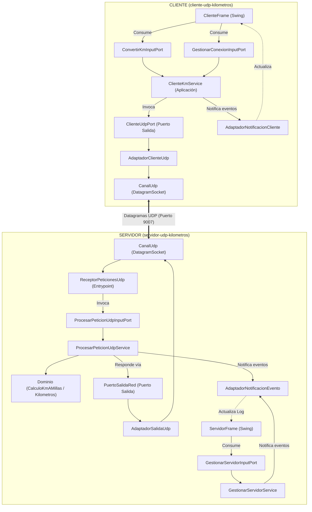

# Taller UDP: Conversión de Kilómetros a Millas con Arquitectura Hexagonal

Proyecto académico para la asignatura de **Sistemas Distribuidos** (8vo Semestre).
Esta solución implementa el **Ejercicio 4 (Conversión de Kilómetros a Millas)** migrado del modelo **TCP** tradicional a un sistema distribuido con **Protocolo UDP (User Datagram Protocol)** bajo una **Arquitectura Hexagonal (Puertos y Adaptadores)** estricta, desacoplada y orientada a objetos.

---

## 🎯 Objetivo y Contexto

- **Fórmula de Conversión**: $1\text{ km} = 0.621371\text{ millas}$
- **Paradigma de Red**: Migración de conexión continua punto a punto (TCP `Socket`) a comunicación sin conexión mediante datagramas (`DatagramSocket`, `DatagramPacket`).
- **Arquitectura de Software**: Eliminación del acoplamiento entre la lógica de red, la interfaz gráfica Swing y las reglas de negocio mediante **Hexagonal Architecture** y el **Patrón Observador**.

---

## 🏛️ Comparativa: Solución Original (TCP) vs Solución Hexagonal (UDP)

| Criterio | Solución Original (TCP) | Nueva Solución Hexagonal (UDP) |
| :--- | :--- | :--- |
| **Protocolo de Transporte** | TCP orientado a conexión | UDP sin conexión (datagramas independientes) |
| **Manejo de Concurrencia** | Hilo por cliente (`SubProcesoCliente`) y `ServerSocket.accept()` | Un solo bucle de escucha UDP concurrente con despacho desacoplado |
| **Tolerancia a Caídas / Timeout**| Detección pasiva por desconexión / `EOFException` | `socket.setSoTimeout(3000)` para detectar falta de respuesta del servidor |
| **Formato del Mensaje** | Flujo binario (`DataInputStream` / `DataOutputStream`) | Mensajería de texto estructurada UTF-8 (`CONVERTIR;15.5` -> `OK_CONVERSION;9.6313;...`) |
| **Acoplamiento UI** | La red manipulaba directamente los componentes de Swing | UI y Red se comunican únicamente a través de Puertos de Entrada y Observadores |
| **Separación de Capas** | Código mezclado en clases controladoras | Dominio puro, Aplicación (casos de uso) y Adaptadores aislados |

---

## 📐 Diagrama de Arquitectura Hexagonal



---

## 📡 Protocolo de Mensajería UDP

Los paquetes viajan codificados en **UTF-8** utilizando delimitadores punto y coma (`;`):

1. **Verificación de conexión lógica**:
   - `Cliente -> Servidor`: `CONECTAR`
   - `Servidor -> Cliente`: `CONECTADO_OK;Servidor UDP listo para recibir conversiones de Km a Millas.`
2. **Conversión de distancia**:
   - `Cliente -> Servidor`: `CONVERTIR;<kilometros>` *(ejemplo: `CONVERTIR;15.5`)*
   - `Servidor -> Cliente`: `OK_CONVERSION;<millas>;<mensaje>` *(ejemplo: `OK_CONVERSION;9.6313;15.50 km equivalen a 9.6313 millas`)*
3. **Desconexión voluntaria**:
   - `Cliente -> Servidor`: `DESCONECTAR`
   - `Servidor -> Cliente`: `DESCONECTADO_OK;Sesión finalizada.`
4. **Errores controlados**:
   - `Servidor -> Cliente`: `ERROR;<mensaje explicativo>`

---

## 📁 Estructura del Repositorio

```text
Taller UDP/
├── servidor/
│   ├── pom.xml
│   └── src/
│       ├── main/java/kilometros/
│       │   ├── Main.java                        # Composition Root del servidor
│       │   ├── dominio/
│       │   │   ├── enums/                       # EstadoServidor, TipoRespuesta
│       │   │   ├── excepciones/                 # DominioException, KilometrosInvalidosException, etc.
│       │   │   ├── modelos/                     # CalculoKmAMillas, ResultadoConversion, RespuestaCliente
│       │   │   ├── puertos/salida/              # PuertoSalidaRed, ControladorServidorRedPort, etc.
│       │   │   └── vo/                          # Kilometros, Millas, Destinatario, PuertoRed
│       │   ├── aplicacion/
│       │   │   ├── dto/                         # ProcesarPeticionUdpCommand, etc.
│       │   │   ├── mapper/                      # CalculoMapper, PeticionMapper
│       │   │   ├── puertos/entrada/             # ProcesarPeticionUdpInputPort, GestionarServidorInputPort
│       │   │   └── servicios/                   # ProcesarPeticionUdpService, GestionarServidorService
│       │   ├── adaptadores/red/                 # CanalUdp, AdaptadorSalidaUdp, UdpNetworkMapper
│       │   └── entrypoint/
│       │       ├── gui/                         # ServidorFrame (Swing)
│       │       └── udp/                         # ReceptorPeticionesUdp
│       └── test/java/kilometros/                # Pruebas unitarias e integración del servidor
│
├── cliente/
│   ├── pom.xml
│   └── src/
│       ├── main/java/kilometros/
│       │   ├── Main.java                        # Composition Root del cliente
│       │   ├── dominio/
│       │   │   ├── enums/                       # EstadoConexion
│       │   │   ├── excepciones/                 # DominioException, KilometrosInvalidosException, etc.
│       │   │   ├── modelos/                     # DatosConversion, ResultadoConversion, EventoCliente
│       │   │   ├── puertos/salida/              # ClienteUdpPort, PuertoNotificacionCliente
│       │   │   └── vo/                          # Kilometros, DestinoServidor
│       │   ├── aplicacion/
│       │   │   ├── dto/                         # ConectarCommand, ConvertirKmCommand
│       │   │   ├── excepciones/                 # ClienteRedException
│       │   │   ├── mapper/                      # ClienteMapper
│       │   │   ├── puertos/entrada/             # ConvertirKmInputPort, GestionarConexionInputPort
│       │   │   └── servicios/                   # ClienteKmService
│       │   ├── adaptadores/
│       │   │   ├── notificacion/                # AdaptadorNotificacionCliente, ObservadorCliente
│       │   │   └── red/                         # CanalUdp, AdaptadorClienteUdp, ProtocoloUdpMapper
│       │   └── entrypoint/gui/                  # ClienteFrame (Swing)
│       └── test/java/kilometros/                # Pruebas unitarias e integración del cliente
└── README.md
```

---

## 🚀 Guía de Compilación y Ejecución

### Requisitos Previos
- **Java Development Kit (JDK)**: 17 o superior.
- **Apache Maven**: 3.8 o superior.

### 1. Servidor
Abrir una terminal en la carpeta `servidor/`:
```bash
# Compilar y ejecutar pruebas automatizadas
mvn clean test

# Iniciar la interfaz gráfica del servidor
mvn exec:java
```
En la ventana del Servidor:
1. Dejar el puerto por defecto (`9007`) o ingresar uno nuevo.
2. Hacer clic en **INICIAR**. El estado pasará a `ONLINE` y el servidor quedará escuchando datagramas.

---

### 2. Cliente
Abrir una segunda terminal en la carpeta `cliente/`:
```bash
# Compilar y ejecutar pruebas automatizadas
mvn clean test

# Iniciar la interfaz gráfica del cliente
mvn exec:java
```
En la ventana del Cliente:
1. Verificar que la IP apunte al servidor (por defecto `127.0.0.1`) y el puerto sea `9007`.
2. Presionar **CONECTAR**. Se enviará el datagrama `CONECTAR` y, al recibir la confirmación, el estado cambiará a `CONECTADO`.
3. Ingresar la distancia en kilómetros (por ejemplo `10.5`) y presionar **CONVERTIR**.
4. Visualizar el resultado en millas calculado por el servidor con 4 decimales de precisión (`6.5244`) y el mensaje descriptivo correspondiente.
5. Revisar la pestaña **LOG DE EVENTOS** para inspeccionar la traza completa de paquetes enviados y recibidos.

---

## 🎓 Guía para la Sustentación ante el Docente

1. **¿Por qué usar Arquitectura Hexagonal en este taller?**
   - Permite que el núcleo del negocio (el cálculo de kilómetros a millas y sus reglas) permanezca completamente aislado e independiente de la tecnología de red (UDP) y del framework gráfico (Swing). Si mañana se migra a REST, gRPC o WebSockets, el dominio no cambia ni una sola línea.
2. **¿Cómo se desacopló la UI de la Red?**
   - En la versión original TCP, el socket modificaba directamente los componentes visuales de la ventana. En la versión Hexagonal se usa el **Patrón Observador**: los servicios notifican eventos a través de puertos de salida (`PuertoNotificacionEvento` y `PuertoNotificacionCliente`), y las vistas Swing solo actúan como observadores pasivos.
3. **¿Cómo maneja UDP la falta de conexión?**
   - UDP no tiene establecimiento de conexión a nivel de transporte (`3-way handshake`). Por ello, se implementó un handshake lógico (`CONECTAR` / `CONECTADO_OK`) y un **timeout** mediante `socket.setSoTimeout(3000)`. Si el servidor está apagado o se pierde un paquete, el cliente no se bloquea indefinidamente sino que captura `SocketTimeoutException` y notifica al usuario.
4. **¿Dónde residen las validaciones?**
   - Los **Value Objects** (`Kilometros`, `DestinoServidor`, `PuertoRed`) garantizan sus invariantes en el constructor. No es posible crear una distancia negativa o un puerto inválido en ninguna parte del sistema.
